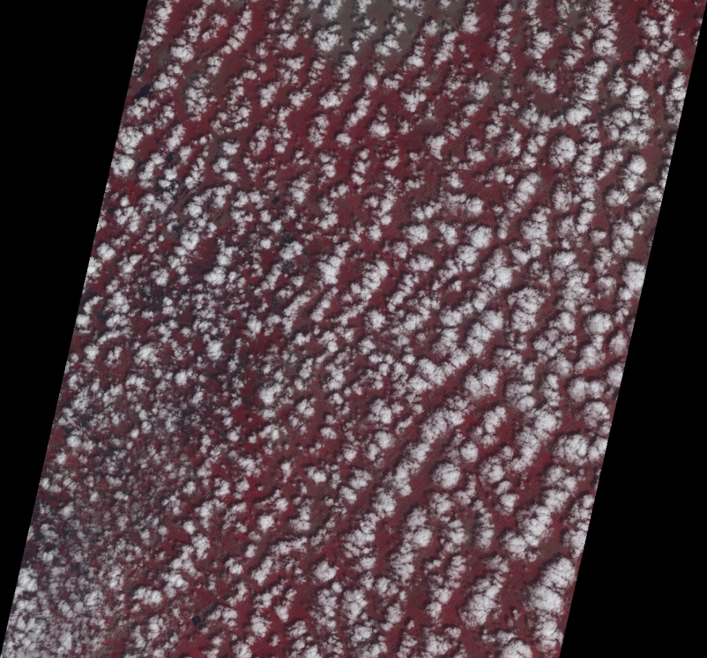
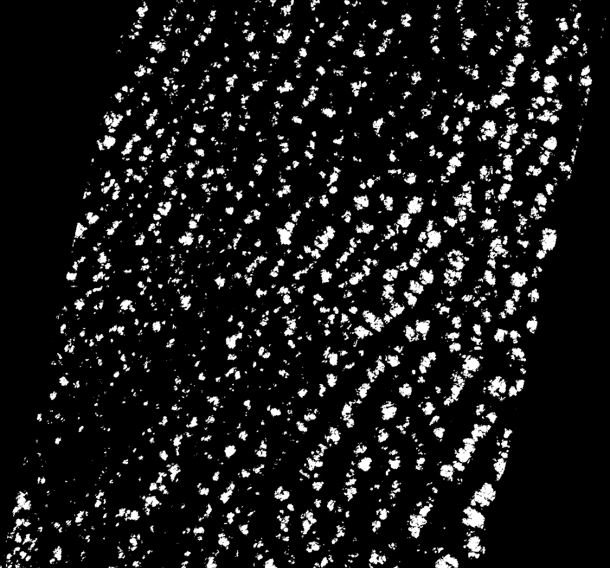

# NRSC Cloud & Shadow Segmentation Project
[**Certificate of Achievement (ISRO)**](RACHIT%20GUPTA_certificate.pdf) | [**Project Report**](Report.pdf)

This project implements a SwinUNet-based deep learning model for separating clouds and shadows from satellite imagery. It includes a complete pipeline from data preprocessing to training, inference, and GeoTIFF generation.
*The Certificates were given to only those participants who submitted a working model 

## 🖼️ Sample Results (Reference)
Below are sample inputs and outputs for reference. Note: The input and output below are structural examples and may not correspond to the exact same image instance due to dataset separation.

| Sample Input (RGB Crop) | Sample Output (Predicted Mask) |
|:---:|:---:|
|  |  |


## 📂 Project Structure

```bash
NRSC_Project/
├── data/                       # Dataset directory
│   ├── TestData-Cloud-Shadow/  # Test data for inference
│   ├── auto_rgb_images/        # Preprocessed training images (generated)
│   └── auto_rgb_pseudo_masks/  # Preprocessed training masks (generated)
├── scripts/                    # Core scripts
│   ├── dataset.py              # PyTorch Dataset class
│   ├── model.py                # Model definition
│   ├── unet_model.py           # Alternative UNet implementation
│   ├── train.py                # Main training script
│   └── predict_test.py         # Inference script used for testing
├── generate_rgb_and_masks.py   # Data preparation script
├── convert_predictions_to_geotiff.py # Post-processing script
├── requirements.txt            # Python dependencies
└── best_model_swinunet.pth     # Trained model checkpoint
```

## 🚀 Setup & Installation

1.  **Clone or navigate to the project directory**
2.  **Install dependencies**:
    Ensure you have Python installed. Then run:
    ```bash
    pip install -r requirements.txt
    ```

## 🛠️ Usage Pipeline

### 1. Data Preparation
Before training, you need to generate RGB images and pseudo-masks from the raw satellite bands.

Run the data generation script:
```bash
python generate_rgb_and_masks.py
```
*   This reads `BAND*.tif` files from the `data/` directory.
*   Generates paired RGB images and masks.
*   **Note**: Ensure the generated `auto_rgb_images` and `auto_rgb_pseudo_masks` folders are located where `train.py` expects them (default: inside `data/` folder). You may need to move them:
    ```bash
    mv auto_rgb_images data/
    mv auto_rgb_pseudo_masks data/
    ```

### 2. Training
To train the model (SwinUNet) on the prepared dataset:

```bash
python scripts/train.py
```
*   Adjust hyperparameters (Epochs, Batch Size, etc.) inside `train.py` if needed.
*   The best model will be saved as `best_model_swinunet.pth`.

### 3. Inference
To generate predictions on the test dataset:

```bash
python scripts/predict_test.py
```
*   This script loads `best_model_swinunet.pth`.
*   Processes images in `data/TestData-Cloud-Shadow`.
*   Outputs predicted masks (as PNGs) to `NRCC251128_output`.

### 4. Post-Processing (GeoTIFF Conversion)
To convert the predicted PNG masks into georeferenced TIFF files (using the original satellite metadata):

```bash
python convert_predictions_to_geotiff.py
```
*   Reads predictions from `NRCC251128_output`.
*   Uses metadata from the original input files.
*   Saves the final GeoTIFFs to `NRCC251128_output/GeoTIFFs`.

## 📦 Dependencies
*   torch
*   torchvision
*   segmentation-models-pytorch
*   timm
*   Pillow
*   numpy
*   tqdm
*   tifffile
*   rasterio (Ensure this is installed for geospatial operations)
